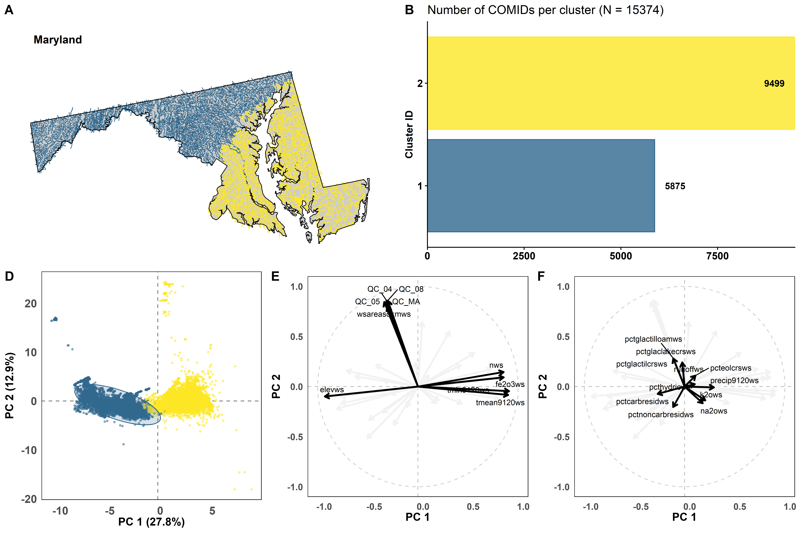

```{r setup, include=FALSE}
knitr::opts_chunk$set(echo = TRUE)
```

# CASTool Helper Package

## Define parameters
-  The package retrieves CASTool inputs by state. The functions accept the capitalized names of states. 
-  Users must specify the number of desired clusters for cluster assignments data (getClusterData) and figures (getClusterFig). Users can specify any integer 1-5 or "default," which will select the default number of clusters assigned by the clustering algorithm as described in the CASTool documentation.  

```{r}
library(CASToolHelperPckg)

state <- "Maryland"
clust_num <- "default"
```

## Retrieve state boundary
```{r}
state_boundary <- getBoundary(state)

mapview::mapview(state_boundary)
```

## Retrieve reaches in a state
```{r}
state_reaches <- getReaches(state)

mapview::mapview(state_reaches)
```

## Retrieve clustering data
```{r}
state_clust_data <- getSCClusterData(state)

head(state_clust_data)
```

## Retrive cluster assignments
```{r}
state_clust_assign <- getClusterData(state, clust_num)

head(state_clust_assign)
```

## Retrive cluster assignments figure
```{r}
state_clustfig <- getClusterFig(state, clust_num)

out_file <- "man/figures/cluster_graphic.png"

dir.create(dirname(out_file), recursive = TRUE, showWarnings = FALSE)

aws.s3::save_object(
  object = state_clustfig,
  bucket = "dmap-data-commons-ow",
  file = out_file
)
```


## Retrieve watershed stressor data
```{r}
state_wsstress <- getWSStressorData(state)

head(state_wsstress)
```

## Retrieve watershed stressor metadata
```{r}
wsstress_info <- getWSStressorInfo()

head(wsstress_info)
```

