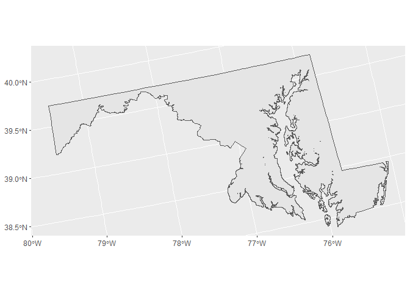
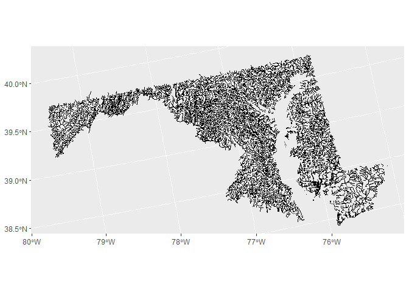

README
================
Laura Naslund
2026-07-27

# CASTool Helper Package

## Install package

``` r
if(!require(remotes)){install.packages("remotes")}  #install if needed
remotes::install_github("laura-naslund/CASToolHelperPckg", force=TRUE)
```

## Define parameters

- The package retrieves CASTool inputs by state. The functions accept
  the capitalized names of states.
- Users must specify the number of desired clusters for cluster
  assignments data (getClusterData) and figures (getClusterFig). Users
  can specify any integer 1-5 or “default,” which will select the
  default number of clusters assigned by the clustering algorithm as
  described in the CASTool documentation.

``` r
library(CASToolHelperPckg)
library(ggplot2)

state <- "Maryland"
clust_num <- "default"
```

## Retrieve state boundary

``` r
state_boundary <- getBoundary(state)

ggplot()+
  geom_sf(data = state_boundary)
```

<!-- -->

## Retrieve reaches in a state

``` r
state_reaches <- getReaches(state)

ggplot()+
  geom_sf(data = state_reaches)
```

<!-- -->

## Retrieve clustering data

``` r
state_clust_data <- getSCClusterData(state)

head(state_clust_data)
```

    ## # A tibble: 6 × 45
    ##     comid al2o3ws bfiws caows clayws compstrgthws  elevws fe2o3ws hydrlcondws
    ##     <dbl>   <dbl> <dbl> <dbl>  <dbl>        <dbl>   <dbl>   <dbl>       <dbl>
    ## 1 4651324    14.5  53.3 2.43    19.8      108.    101.       6.63       0.168
    ## 2 4652194    14.4  53.3 2.39    19.8      108.    101.       6.58       0.168
    ## 3 8376303    11.0  52.1 0.974   14.3        0.948  30.7      8.99      13.1  
    ## 4 8377513    12.3  49   1.37    18.7        0.989   1.47    14.8        6.08 
    ## 5 8379285    10.5  51.0 1.93    23.5        0.674   0.604    3.14       8.23 
    ## 6 8377495    12.3  49   1.36    18.7        1.00    2.67    14.7        6.09 
    ## # ℹ 36 more variables: k2ows <dbl>, kffactws <dbl>, mgows <dbl>, na2ows <dbl>,
    ## #   nws <dbl>, omws <dbl>, p2o5ws <dbl>, pctalluvcoastws <dbl>,
    ## #   pctnoncarbresidws <dbl>, pctsilicicws <dbl>, permws <dbl>,
    ## #   precip9120ws <dbl>, rckdepws <dbl>, runoffws <dbl>, sandws <dbl>,
    ## #   sio2ws <dbl>, sws <dbl>, tmax9120ws <dbl>, tmean9120ws <dbl>,
    ## #   tmin9120ws <dbl>, wetindexws <dbl>, wtdepws <dbl>, pctalkintruvolws <dbl>,
    ## #   pctcarbresidws <dbl>, pctcoastcrsws <dbl>, pctcolluvsedws <dbl>, …

## Retrive cluster assignments

``` r
state_clust_assign <- getClusterData(state, clust_num)

head(state_clust_assign)
```

    ## # A tibble: 6 × 2
    ##     COMID ClusterID
    ##     <int>     <int>
    ## 1 4651324         1
    ## 2 4652194         1
    ## 3 8376303         2
    ## 4 8377513         2
    ## 5 8379285         2
    ## 6 8377495         2

## Retrive cluster assignments figure

``` r
state_clustfig <- getClusterFig(state, clust_num)

out_file <- "man/figures/cluster_graphic.png"

dir.create(dirname(out_file), recursive = TRUE, showWarnings = FALSE)

aws.s3::save_object(
  object = state_clustfig,
  bucket = "dmap-data-commons-ow",
  file = out_file
)
```

<figure>

<figcaption aria-hidden="true">Cluster graphic</figcaption>
</figure>

## Retrieve watershed stressor data

``` r
state_wsstress <- getWSStressorData(state)

head(state_wsstress)
```

    ## # A tibble: 6 × 4
    ##     COMID StreamCatVar WatershedValue  Year
    ##     <dbl> <chr>                 <dbl> <int>
    ## 1 4651324 coalminedens             0     NA
    ## 2 4651324 n_ags_                8856.  1987
    ## 3 4651324 n_ags_                8583.  1988
    ## 4 4651324 n_ags_                8076.  1989
    ## 5 4651324 n_ags_                8135.  1990
    ## 6 4651324 n_ags_                8140.  1991

## Retrieve watershed stressor metadata

``` r
wsstress_info <- getWSStressorInfo()

head(wsstress_info)
```

    ##   StreamCatVar    SCmetrics Year                           Label
    ## 1 coalminedens coalminedens   NA Coal mine density (mines/sq km)
    ## 2       n_ags_   n_ags_1987 1987     N agricultural surplus (kg)
    ## 3       n_ags_   n_ags_1988 1988     N agricultural surplus (kg)
    ## 4       n_ags_   n_ags_1989 1989     N agricultural surplus (kg)
    ## 5       n_ags_   n_ags_1990 1990     N agricultural surplus (kg)
    ## 6       n_ags_   n_ags_1991 1991     N agricultural surplus (kg)
    ##                           DataSource
    ## 1                         USGS NCRDS
    ## 2 US EPA National Nutrient Inventory
    ## 3 US EPA National Nutrient Inventory
    ## 4 US EPA National Nutrient Inventory
    ## 5 US EPA National Nutrient Inventory
    ## 6 US EPA National Nutrient Inventory
